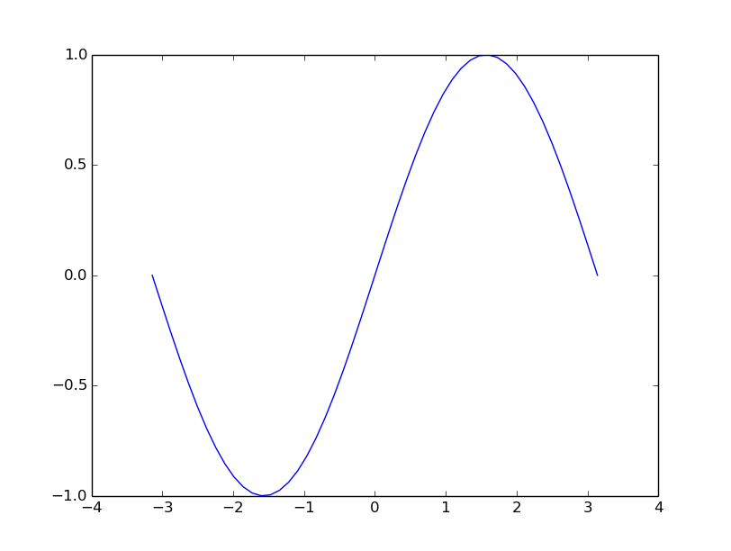
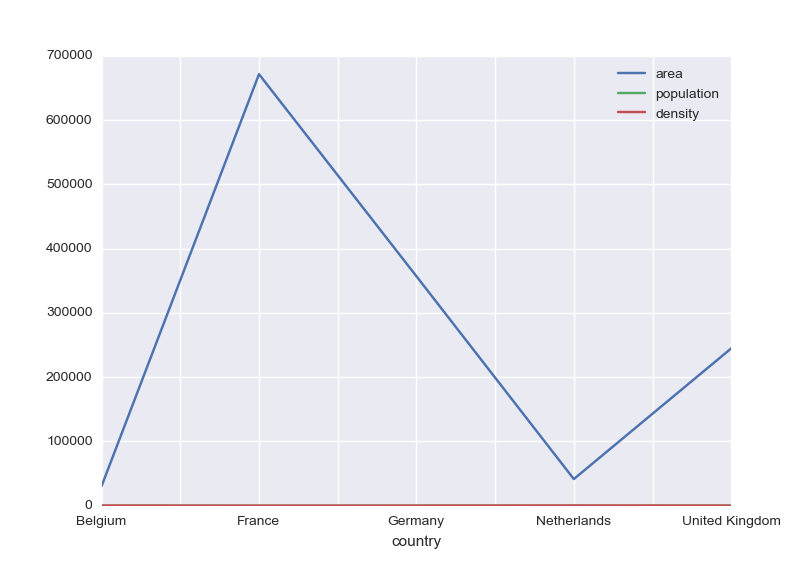
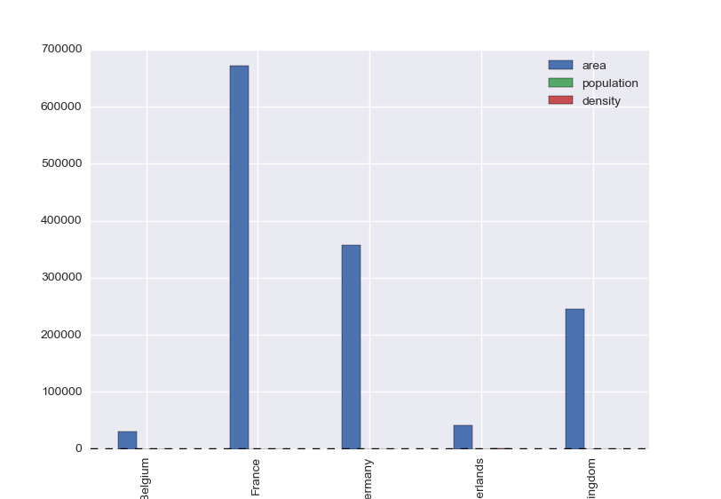

<script type="text/javascript"
  src="https://cdn.mathjax.org/mathjax/latest/MathJax.js?config=TeX-AMS-MML_HTMLorMML">
</script>
# Scientific libraries

## 

CB2060 Applied programming for life sciences
KTH

---

layout: false

# TOC
* [Scientific libraries](#1)
  + [What can you do with Python libraries](#3)
  + [What is a library?](#4)
  + [Builtins](#5)
  + [Standard library](#6)
  + [External Python libraries](#7)
  + [Are you a math genius?](#8)
  + [More linear algebra](#27)
  + [Refernces](#29)
  + [Matplotlib](#30)
  + [First example](#31)
  + [The `pandas` module](#35)

---

## What can you do with Python libraries

*This year’s Nobel Prize in economics was awarded to a Python convert*


https://qz.com/1417145/economics-nobel-laureate-paul-romer-is-a-python-programming-convert/


*Instead of using Mathematica, Romer discovered that he could use a Jupyter
notebook for sharing his research. <mark>Jupyter notebooks</mark> are web
applications that allow programmers and researchers to share documents that
include code, charts, equations, and data. Jupyter notebooks allow for code
written in dozens of programming languages. For his research, Romer used
<mark>Python—the most popular language for data science and statistics.</mark>*

---
## What can you do with Python libraries


*Take a picture of a black hole*


https://doi.org/10.3847/2041-8213/ab0e85


*Software: DiFX (Deller et al. 2011), CALC, PolConvert (Martí-Vidal et al.  2016), HOPS (Whitney et al. 2004), CASA (McMullin et al. 2007), AIPS (Greisen 2003), ParselTongue (Kettenis et al. 2006), GNU Parallel (Tange 2011), GILDAS, eht-imaging (Chael et al. 2016, 2018), <mark>Numpy</mark> (van der Walt et al.  2011), <mark>Scipy</mark> (Jones et al. 2001), <mark>Pandas</mark> (McKinney 2010), Astropy (The Astropy Collaboration et al. 2013, 2018), <mark>Jupyter</mark> (Kluyver et al. 2016), <mark>Matplotlib</mark> (Hunter 2007).*


---

## What is a library?

* A Python source file
* A directory with source files
* Builtin
* Standard library (requires import)
* External libraries (requires install)

---

## Builtins

```
>>> dir()
['__annotations__', '__builtins__', '__doc__', '__loader__', '__name__', '__package__', '__spec__']
```

~~~
>>> __builtins__
<module 'builtins' (built-in)>
~~~
~~~
>>> dir(__builtins__)
[
...
 'print',
 'property',
 'quit',
 'range',
 'repr',
 'reversed',
 'round',
 'set',
 'setattr',
 'slice',
 'sorted',
 'staticmethod',
 'str',
 'sum',
 'super',
 'tuple',
 'type',
 'vars',
 'zip']
~~~

---

## Standard library

Included in all distributions, but requires an import statement for access

~~~
>>> import math
>>> print(math.pi)
3.141592653589793
~~~

https://docs.python.org/3/library/


---

## External Python libraries

- NumPy: 'Numerical python', linear algebra, https://www.numpy.org/

- Pandas: High-level library for tabular data, https://pandas.pydata.org/

- Matplotlib: fundamental plotting module, https://matplotlib.org/


<!--
If ModuleNotFoundError, install first

import sys
!conda install --yes --prefix {sys.prefix} numpy (or pandas or matplotlib)

import pandas (or numpy or matplotlib.pyplot) as pd (or np or plt)

-->


---

## Are you a math genius?


* First three rows a linear system of equations
* Identify the coefficient matrix and right-hand side
* Last line represents an expression of the solutions

$$
\begin{pmatrix}
3 &0 &0 \\\
1 &8 &0 \\\
0 &4 &-2
\end{pmatrix}
\begin{pmatrix}
a\\\ b \\\ c
\end{pmatrix}
=
\begin{pmatrix}
30\\\ 18 \\\ 2
\end{pmatrix}
$$
$$
a + 3b + c = ?
$$


---

### Linear Algebra in Python: NumPy

* Libraries provided by ``numpy`` provide computational speeds close to compiled languages
* Generally written in C
* From a user perspective they are imported as any python module
* http://www.numpy.org

---

### Creating arrays

* one- and two-dimensional

```
>>> import numpy
>>> a = numpy.zeros(3)
>>> print(type(a), a)
<class 'numpy.ndarray'> [ 0.  0.  0.]
>>> b = numpy.zeros((3, 3))
>>> print(b)
[[ 0.  0.  0.]
 [ 0.  0.  0.]
 [ 0.  0.  0.]]

```

---

### Copying arrays

```
    >>> x = numpy.zeros(2)
    >>> y = x
    >>> x[0] = 1; print(x, y)
    [ 1.  0.] [ 1.  0.]

```
    
Note that assignment (like lists) here is by reference

```
    >>> print(x is y)
    True

```

Numpy array copy method

```
    >>> y = x.copy()
    >>> print(x is y)
    False

```

---

### Filling arrays

``linspace`` returns an array with sequence data

```
    >>> print(numpy.linspace(0,1,6))
    [ 0.   0.2  0.4  0.6  0.8  1. ]

```

``arange`` is a similar function
::
    >>> print(numpy.arange(0, 1, 0.2))
    [ 0.   0.2  0.4  0.6  0.8]

---

### Arrays from list objects

```
    >>> la=[1.,2.,3.]
    >>> a=numpy.array(la)
    >>> print(a)
    [ 1.  2.  3.]

```
```
    >>> lb=[4., 5., 6.]
    >>> ab=numpy.array([la,lb])
    >>> print(ab)
    [[ 1.  2.  3.]
     [ 4.  5.  6.]]

```

---

### Arrays from file data:

* Using `numpy.loadtxt`


```
    #a.dat
    1 2 3
    4 5 6
```

<!--
>>> with open('a.dat', 'w') as adat:
...     n = adat.write('1 2 3\n4 5 6\n')

-->

```
    >>> a = numpy.loadtxt('a.dat')
    >>> print(a)
    [[ 1.  2.  3.]
     [ 4.  5.  6.]]

```
If you have a text file with only numerical data
arranged as a matrix: all rows have the same number of elements

---

### Reshaping

by changing the shape attribute

```
>>> print(ab.shape)
(2, 3)
>>> ab.shape = (6,)
>>> print(ab)
[ 1.  2.  3.  4.  5.  6.]

```

with the reshape method

```
    >>> ba = ab.reshape((3, 2))
    >>> print(ba)
    [[ 1.  2.]
     [ 3.  4.]
     [ 5.  6.]]

```
---

### Views of same data

* ab and ba are different objects but represent different views  of the same data

```
>>> ab[0] = 0
>>> print(ab)
[ 0.  2.  3.  4.  5.  6.]
>>> print(ba)
[[ 0.  2.]
 [ 3.  4.]
 [ 5.  6.]]

```
---

### Array indexing

like lists

* ``a[2:4]`` is an array slice with elements ``a[2]`` and ``a[3]``
* ``a[n:m]`` has size ``m-n``
* ``a[-1]`` is the last element of ``a``
* ``a[:]`` are all elements of ``a``

---

### Looping over elements

```
>>> r, c = ba.shape
>>> for i in range(r):
...    line = ""
...    for j in range(c):
...        line += "%10.3f" % ba[i, j]
...    print(line)
     0.000     4.000
     2.000     5.000
     3.000     6.000

```

or

```
>>> for row in ba:
...     print("".join("%10.3f" % el for el in row))
     0.000     4.000
     2.000     5.000
     3.000     6.000

```

more *Pythonic*

---

* The `ravel` methods returns a one-dim array

```
    >>> for e in ba.ravel():
    ...    print(e)
    0.0
    4.0
    2.0
    5.0
    3.0
    6.0

```
    
---

* ``ndenumerate`` returns indices as well

```
    >>> for ind, val in numpy.ndenumerate(ba):
    ...    print(ind, val )
    (0, 0) 0.0
    (0, 1) 4.0
    (1, 0) 2.0
    (1, 1) 5.0
    (2, 0) 3.0
    (2, 1) 6.0

```

---


### Matrix operations

* explicit looping

```
    >>> import numpy, time
    >>> n=256
    >>> a=numpy.ones((n,n))
    >>> b=numpy.ones((n,n))
    >>> c=numpy.zeros((n,n))
    >>> t1=time.clock()
    >>> for i in range(n):
    ...    for j in range(n):
    ...        for k in range(n):
    ...            c[i,j]+=a[i,k]*b[k,j]
    >>> t2=time.clock()
    >>> print("Loop timing",t2-t1 )
    Loop timing ...

```

---

* using `numpy.dot`

```
    >>> import numpy, time
    >>> n=256
    >>> a=numpy.ones((n,n))
    >>> b=numpy.ones((n,n))
    >>> t1=time.clock()
    >>> c=numpy.dot(a,b)
    >>> t2=time.clock()
    >>> print("dot timing",t2-t1)
    dot ...

```

---

### The Fortran version

```fortran
    INTEGER, PARAMETER :: N = 256
    REAL*8, DIMENSION(N,N) :: A, B, C
    ! Timing
    INTEGER :: T1, T2, RATE
    ! Initialize
    A = 1.0
    B = 1.0
    !
    CALL SYSTEM_CLOCK(COUNT_RATE=RATE)
    CALL SYSTEM_CLOCK(COUNT=T1)
    C = MATMUL(A, B)
    CALL SYSTEM_CLOCK(COUNT=T2)
    PRINT '(A, F6.2)', 'MATMUL timing',  DBLE(T2-T1)/RATE
    END
```
---

### Conclusion

* Provided that numpy has been install properly (difficult) and linked with optimized libraries, basic linear algebra work as fast in python as in Fortran (or C/C++)

---

### More vector operations

* Scalar multiplication ``a*2`` 
* Scalar addition ``a + 2``
* Power (elementwise) ``a**2``

Note that for objects of ``ndarray`` type, multiplication means elementwise multplication and not matrix multiplication

---

### Vectorized elementary functions

```
    >>> v = numpy.arange(0, 1, .2)
    >>> print(v)
    [ 0.   0.2  0.4  0.6  0.8]

```
--
```
    >>> print(numpy.cos(v))
    [ 1.          0.98006658  0.92106099  0.82533561  0.69670671]

```
--
```
    >>> print(numpy.sqrt(v))
    [ 0.          0.4472136   0.63245553  0.77459667  0.89442719]

```
--
```
    >>> print(numpy.log(v))
    ./linalg.py:98: RuntimeWarning: divide by zero encountered in log
      print(numpy.log(v))
    [       -inf -1.60943791 -0.91629073 -0.51082562 -0.22314355]

```

---

## More linear algebra

* Solve a linear  system of equations
$$Ax = b$$

--


```
    x = numpy.linalg.solve(A, b)

```

--

* Determinant of a matrix

$$det(A)$$

--


```
    x = numpy.linalg.det(A)

```

---


* Inverse of a matrix 
$$A^{-1}$$

--

```
    x = numpy.linalg.inverse(A)

```

--

*  Eigenvalues  of a matrix

$$Ax = x\lambda$$

--

```
    x, l = numpy.linalg.eig(A)

```

---

## Refernces

* http://www.numpy.org
* http://www.scipy-lectures.org/intro/numpy/index.html
* Videos: https://pyvideo.org/search.html?q=numpy

---


## Matplotlib

- The standard 2D-plotting library in Python
- Production-quality graphs
- Interactive and non-interactive use
- Many output formats
- Flexible and customizable

---

## First example

### The absolute minimum  you need to know

* You have a set of points (x,y) on file

```
-3.141593 -0.000000
-3.013364 -0.127877
-2.885136 -0.253655
...
3.141593 0.000000
```
--

* How do you get to  this



---

### Next

* Import the plotting library
```
import matplotlib.pyplot as plt
import numpy as np
```
--

* Load the data from file
```
data = np.loadtxt('filename')
```
--

* Call the `plot` function
```
plt.plot(data[:, 0], data[:, 1])
```
--

* Show the result
```
plt.show()
```

*Note:* in Jupyter notebook you may want to do
```
%matplotlib inline
```
---

### Next? 

#### Refinement

* Change color, linestyle, linewidth
--


* Change window size (ylim)
--


* Change xticks
--


* Set title
--


* Multi-line plots
--


* Legends

---

### In practice

How do you do when need a particlar type of figure?

* Go to the matplotlib gallery: http://matplotlib.org/gallery
* Try some exercises at http://scipy-lectures.github.io/intro/matplotlib/matplotlib.html#other-types-of-plots-examples-and-exercises
* See also: https://realpython.com/python-matplotlib-guide/


---

## The `pandas` module

Setup:

```
>>> import pandas as pd
>>> import numpy as np
>>> import matplotlib.pyplot as plt

```

Two main data structures

* Series
* Data frames
---

### Series

One-dimensional labeled data

```
>>> s = pd.Series([0.1, 0.2, 0.3, 0.4])
>>> print(s)
0    0.1
1    0.2
2    0.3
3    0.4
dtype: float64

```
--
```
>>> print(s.index)
Int64Index([0, 1, 2, 3], dtype='int64')

```
--
```
>>> print(s.values)
[ 0.1  0.2  0.3  0.4]

```

---

* indices can be labels (like a dict with order)

```
>>> s = pd.Series(np.arange(4), index=['a', 'b', 'c', 'd'])
>>> print(s)
a    0
b    1
c    2
d    3
dtype: int64
>>> print(s['d'])
3
>>>
```
--
* Initialize with dict

```
>>> s = pd.Series({'a': 1, 'b': 2, 'c': 3, 'd': 4})
>>> print(s)
a    1
b    2
c    3
d    4
dtype: int64
>>>
```
--
* Indexing as a dict

```
>>> print(s['a'])
1

```
---

* Elementwise operations
```
>>> print(s * 100)
a    100
b    200
c    300
d    400
dtype: int64
>>>
```
--

* Slicing
```
>>> s['b': 'c']
b    200
c    300
dtype: int64
>>>
```

---

* List indexing
```
>>> print(s[['b', 'c']])
b    2
c    3
dtype: int64
>>>
```
--

* Bool indexing
```
>>> print(s[s>2])
c    3
d    4
dtype: int64
>>>
```
--

* Other operations
```
>>> s.mean()
2.5
>>>
```
---

* Alignment on indices
```
>>> s['a':'b'] + s['b':'c']
a   NaN
b     4
c   NaN
dtype: float64
>>>
```
---

### DataFrames

* Tabular data structure (like spreadsheet, sql table)
* Multiple series with common index

```
>>> data = {'country': ['Belgium', 'France', 'Germany', 'Netherlands', 'United Kingdom'],
...        'population': [11.3, 64.3, 81.3, 16.9, 64.9],
...        'area': [30510, 671308, 357050, 41526, 244820],
...        'capital': ['Brussels', 'Paris', 'Berlin', 'Amsterdam', 'London']}
>>>
```
--
```
>>> countries = pd.DataFrame(data)
>>> print(countries)
     area    capital         country  population
0   30510   Brussels         Belgium        11.3
1  671308      Paris          France        64.3
2  357050     Berlin         Germany        81.3
3   41526  Amsterdam     Netherlands        16.9
4  244820     London  United Kingdom        64.9
>>>
```

---

* Attributes: index, columns, dtypes, values

```
>>> countries.index
Int64Index([0, 1, 2, 3, 4], dtype='int64')
>>>
```
--
```
>>> countries.columns
Index(['area', 'capital', 'country', 'population'], dtype='object')
>>>
```
--
```
>>> countries.dtypes
area            int64
capital        object
country        object
population    float64
dtype: object
>>>
```
--
```
>>> countries.values
array([[30510, 'Brussels', 'Belgium', 11.3],
       [671308, 'Paris', 'France', 64.3],
       [357050, 'Berlin', 'Germany', 81.3],
       [41526, 'Amsterdam', 'Netherlands', 16.9],
       [244820, 'London', 'United Kingdom', 64.9]], dtype=object)
>>>
```
---
* Info
```
>>> countries.info()
<class 'pandas.core.frame.DataFrame'>
Int64Index: 5 entries, 0 to 4
Data columns (total 4 columns):
area          5 non-null int64
capital       5 non-null object
country       5 non-null object
population    5 non-null float64
dtypes: float64(1), int64(1), object(2)
memory usage: 200.0 bytes
>>>
```
---

* Set a column as index
```
>>> print(countries)
     area    capital         country  population
0   30510   Brussels         Belgium        11.3
1  671308      Paris          France        64.3
2  357050     Berlin         Germany        81.3
3   41526  Amsterdam     Netherlands        16.9
4  244820     London  United Kingdom        64.9
>>>
```
--
```
>>> countries = countries.set_index('country')
>>>
```
--
```
>>> print(countries)
                  area    capital  population
country                                      
Belgium          30510   Brussels        11.3
France          671308      Paris        64.3
Germany         357050     Berlin        81.3
Netherlands      41526  Amsterdam        16.9
United Kingdom  244820     London        64.9
>>>
```

---

* Access a single series in a table
```
>>> print(countries['area'])
country
Belgium            30510
France            671308
Germany           357050
Netherlands        41526
United Kingdom    244820
Name: area, dtype: int64
>>>
```
--
```
>>> print(countries['capital']['France'])
Paris
>>>
```
--

* Arithmetic (population density)
```
>>> print(countries['population']/countries['area']*10**6)
country
Belgium           370.370370
France             95.783158
Germany           227.699202
Netherlands       406.973944
United Kingdom    265.092721
dtype: float64
>>>
```

---


* Add new column
```
>>> countries['density'] =  countries['population']/countries['area']*10**6
>>> print(countries)
                  area    capital  population     density
country                                                  
Belgium          30510   Brussels        11.3  370.370370
France          671308      Paris        64.3   95.783158
Germany         357050     Berlin        81.3  227.699202
Netherlands      41526  Amsterdam        16.9  406.973944
United Kingdom  244820     London        64.9  265.092721
>>>
```

--

* Filter data
```
>>> print(countries[countries['density'] > 300])
              area    capital  population     density
country                                              
Belgium      30510   Brussels        11.3  370.370370
Netherlands  41526  Amsterdam        16.9  406.973944
>>>
```
---

* Sort data
```
>>> print(countries.sort_values('density', ascending=False))
                  area    capital  population     density
country                                                  
Netherlands      41526  Amsterdam        16.9  406.973944
Belgium          30510   Brussels        11.3  370.370370
United Kingdom  244820     London        64.9  265.092721
Germany         357050     Berlin        81.3  227.699202
France          671308      Paris        64.3   95.783158
>>>
```

--

* Statistics
```
>>> print(countries.describe())
                area  population     density
count       5.000000    5.000000    5.000000
mean   269042.800000   47.740000  273.183879
std    264012.827994   31.519645  123.440607
min     30510.000000   11.300000   95.783158
25%     41526.000000   16.900000  227.699202
50%    244820.000000   64.300000  265.092721
75%    357050.000000   64.900000  370.370370
max    671308.000000   81.300000  406.973944
>>>
```
---

* Plotting
```
>>> countries.plot()
>>>
```

---
* Plotting barchart
```
>>> countries.plot(kind='bar')
>>>
```

---

### Features

* like numpy arrays with labels
* supported import/export formats: CSV, SQL, Excel...
* support for missing data
* support for heterogeneous data
* merging data
* reshaping data
* easy plotting 

